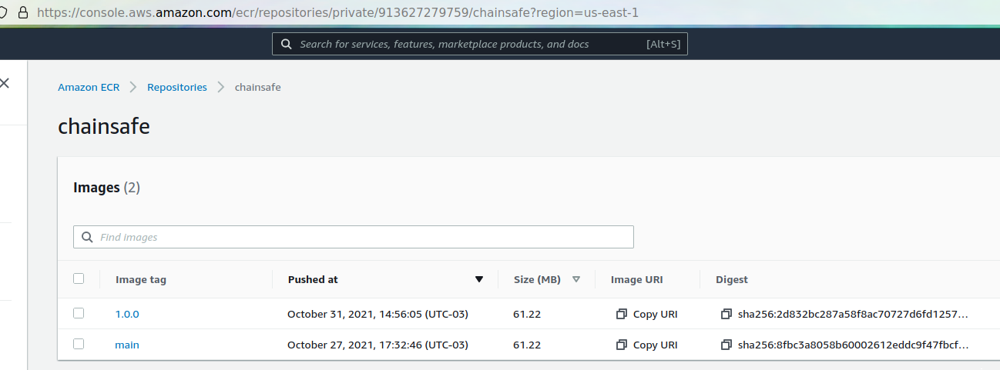

# Solution

## When a Pull Request is created - Run unit testing

For this task, we can check on [this link](https://github.com/mschirbel/chainsafe-exam/runs/4027243007?check_suite_focus=true).

What I did was:

- created a folder called `.github`, for it's mandatory to run GH Actions, as well the `workflows` folder.
- inside the `workflows` folder we have the `status_check.yml` file, which is the workflow that will run on the PR creation. It will install all the dependencies and run the `npm test` command:

```yaml
name: chainsafe-status-check
on: [pull_request]
jobs:
  Chainsafe-Status-Check:
    runs-on: ubuntu-latest
    steps:
      - uses: actions/checkout@v2
      - uses: actions/setup-node@v2
        with:
          node-version: "16"
      - run: npm install app/
      - run: cd app/ && npm test
```

## When a Pull Request is merged - Deploy a docker image under the main tag

For this task, we can check on [this link](https://github.com/mschirbel/chainsafe-exam/runs/4027298275?check_suite_focus=true).

What I did was:

- created the file `docker_build_main.yml` under the `.githu/workflows` folder.
- create an ECR on my personal AWS Account.
- create an user on my AWS Account with necessary permissions to push an image to ECR
- set the AWS Keys as a secret on my repository, as well the ECR URL


Now, when a PR is closed, merging changes on the main branch, the workflow will run:

```yaml
name: chainsafe-build-main
on:
  pull_request:
    types: [closed]
    branches: [main]
jobs:
  Chainsafe-Build-Main:
    if: ${{ github.event.pull_request.merged }}
    runs-on: ubuntu-latest
    steps:
      - name: Checkout
        uses: actions/checkout@v2

      - name: Configure AWS credentials
        uses: aws-actions/configure-aws-credentials@v1
        with:
          aws-access-key-id: ${{ secrets.AWS_ACCESS_KEY_ID }}
          aws-secret-access-key: ${{ secrets.AWS_SECRET_ACCESS_KEY }}
          aws-region: us-east-1

      - name: Login to Amazon ECR
        id: login-ecr
        uses: aws-actions/amazon-ecr-login@v1

      - name: Build, tag, and push image to Amazon ECR
        env:
          ECR_REGISTRY: ${{ secrets.ECR_URL }}
          ECR_REPOSITORY: chainsafe
          IMAGE_TAG: main
        run: |
          cd app/
          docker build -t $ECR_REGISTRY/$ECR_REPOSITORY:$IMAGE_TAG .
          docker push $ECR_REGISTRY/$ECR_REPOSITORY:$IMAGE_TAG
```

You can check the image on my ECR:


## When a new Release is published - Deploy a docker image with the tag created

For this task you can check [this link](https://github.com/mschirbel/chainsafe-exam/runs/4061220690?check_suite_focus=true).

What I did was:

- Created another workflow, `docker_build_tag.yml`. For every release, we'll create a new image for this tag
- For every tag, following this format `"*.*.*"` and under any branch except the `main` one, we'll create a new image.

```yaml
name: chainsafe-build-tag
on:
  push:
    tags:
      - "*.*.*"
    branches:
      - "!main"
jobs:
  Chainsafe-Build-Tag:
    runs-on: ubuntu-latest
    steps:
      - name: Checkout
        uses: actions/checkout@v2

      - name: Set env
        run: echo "RELEASE_VERSION=${GITHUB_REF#refs/*/}" >> $GITHUB_ENV

      - name: Test
        run: |
          echo $RELEASE_VERSION
          echo ${{ env.RELEASE_VERSION }}

      - name: Configure AWS credentials
        uses: aws-actions/configure-aws-credentials@v1
        with:
          aws-access-key-id: ${{ secrets.AWS_ACCESS_KEY_ID }}
          aws-secret-access-key: ${{ secrets.AWS_SECRET_ACCESS_KEY }}
          aws-region: us-east-1

      - name: Login to Amazon ECR
        id: login-ecr
        uses: aws-actions/amazon-ecr-login@v1

      - name: Build, tag, and push image to Amazon ECR
        env:
          ECR_REGISTRY: ${{ secrets.ECR_URL }}
          ECR_REPOSITORY: chainsafe
          IMAGE_TAG: ${{ env.RELEASE_VERSION }}
        run: |
          cd app/
          docker build -t $ECR_REGISTRY/$ECR_REPOSITORY:$IMAGE_TAG .
          docker push $ECR_REGISTRY/$ECR_REPOSITORY:$IMAGE_TAG
```

You can check the image on my ECR:


